```{r xaringan-themer, include=FALSE, warning=FALSE}
library(xaringanthemer)
style_mono_light(
  base_color = "#042856", 
  header_color = "#7cacd4",
  title_slide_text_color = "#7cacd4",
  link_color = "#0000FF",
  text_color = "#000000",
  background_color = "#FFFFFF",
  header_h1_font_size ="2.00rem"
  )
```


```{r, echo=FALSE, purl=FALSE, message = FALSE}
knitr::opts_chunk$set(comment = "#>", purl = FALSE, fig.showtext = TRUE, retina = 2)
```


```{r xaringan-scribble, echo=FALSE}
xaringanExtra::use_scribble() #activate for the pencil
xaringanExtra::use_xaringan_extra(c("tile_view", "animate_css", "tachyons"))
xaringanExtra::use_panelset() #panel set
```


class: left

# Outline

* What is spatial data?
* Introduction to `sf` package.  
* Geocoding.


---
#### Spatial data
- According to [Wikipedia](https://en.wikipedia.org/wiki/Geographic_data_and_information):
  - **Spatial data** or **geographic data** is a kind of data having an implicit or explicit association with a location relative to Earth (namely, a geographic location or a geographic position).
  - **Spatial data** is also called **geospatial data**, **georeferenced data**, and **geodata**.


---
class: middle, center

<iframe width="720" height="405" src="https://www.youtube.com/embed/gKGOeTFHnKY" title="YouTube video player" frameborder="0" allow="accelerometer; autoplay; clipboard-write; encrypted-media; gyroscope; picture-in-picture" allowfullscreen></iframe>

[Source](https://earthengine.google.com/)

---
#### İTÜ-Satellite Communication and Remote Sensing Center (UHUZAM)
- [UHUZAM](https://web.cscrs.itu.edu.tr/homepage/) is a research center which carries out technological projects on remote sensing and satellite communication within İTÜ.

```{r, echo=F, out.width="%50", out.height="%30", fig.align="center", fig.link="https://web.cscrs.itu.edu.tr/"}
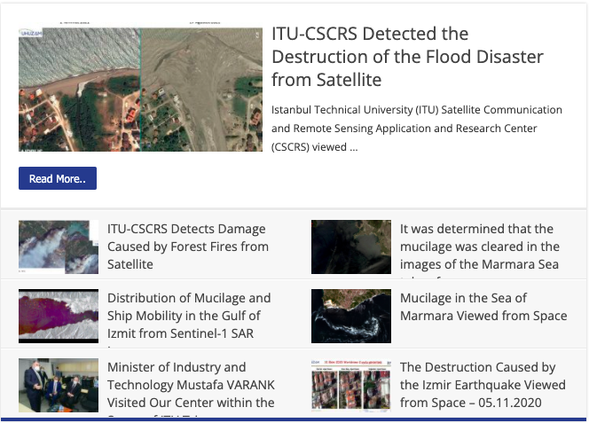
```

---
#### Spatial data types
- **Spatial data** can be broadly classified into two main categories:  
  - **Vector data**: represents the world surface using points, lines, and polygons, and
  - **Raster data**: can be satellite imagery or other pixelated surface.

```{r, echo=F}
knitr::include_graphics("images/vector_raster.pbm")
```

[Source](https://www.researchgate.net/publication/330468019_Highway_Vertical_Alignment_Optimization_Using_Genetic_Algorithm_GA)

---
#### (Geographic) Vector data

```{css echo=FALSE}
.pull-left {
  float: left;
  width: 50%;
}
.pull-right {
  float: right;
  width: 50%;
}
```

.pull-left[
- Vector data are composed of discrete geometric locations (x,y values) known as **vertices** 
that define the **shape** of the spatial object. 
- The organization of the vertices determines the type of vector that you are working with: **point**, **line** or **polygon**.
  - **Points**: Each individual point is defined by a single (x, y) coordinate. Examples of point data include: center point of plot locations, tower locations, and the location of individual trees.
  - **Lines**: Lines are composed of many (at least 2) vertices, or points, that are **connected**. For instance, a road or a stream may be represented by a line. This line is composed of a series of segments, each “bend” in the road or stream represents a vertex that has defined (x, y) location.
  - **Polygons**: A polygon consists of 3 or more vertices that are connected and **closed**, thus building boundaries. Lakes, oceans, and states or countries are often represented by polygons. 
]

.pull-right[

```{r, echo=F, out.height="%10", out.width="%10"}
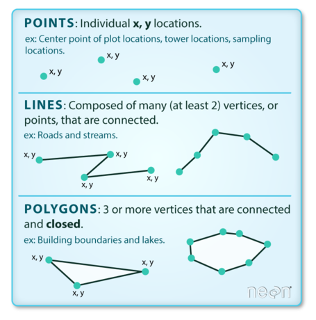
```

[Source](https://www.earthdatascience.org/courses/earth-analytics/spatial-data-r/intro-vector-data-r/)

]

---
#### Some examples on vector data
- In a [touristic Istanbul map](https://istanbulmap360.com/istanbul-neighborhood-map), touristic places that can be geocoded and converted to **points**, ferry routes can be represented as  **lines**, whereas neighbourhood (mahalle) boundaries and green parks are represented as **polygons**.

```{r, echo=F, out.width="%10"}
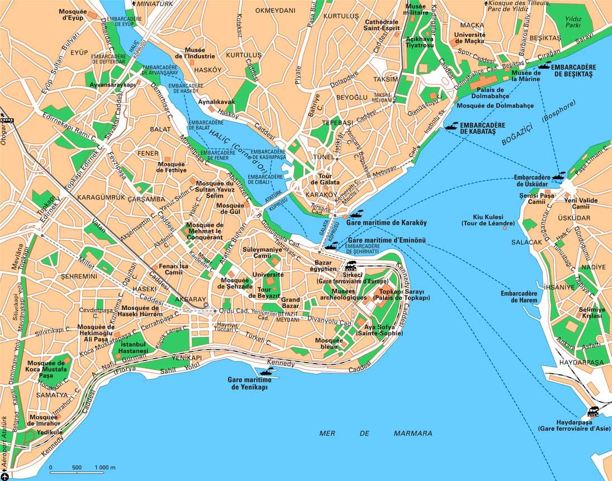
```

---
class: middle, center

```{r, echo=F, out.width="%10", fig.link="https://www.esri.com/en-us/what-is-gis/overview"}
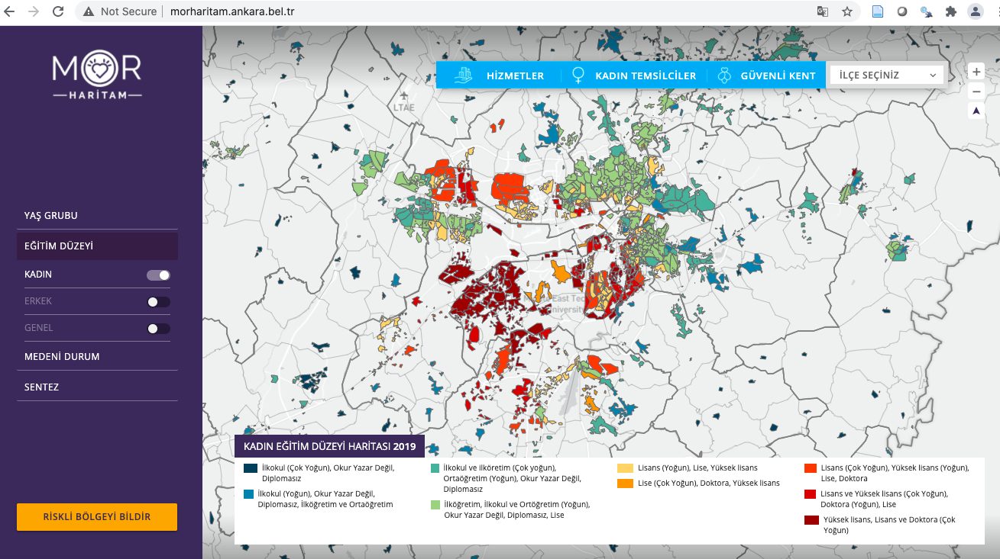
```

[Source](https://www.esri.com/en-us/what-is-gis/overview)

---
class: middle, center

```{r, echo=F, out.width="%10", fig.link="http://morharitam.ankara.bel.tr/"}
knitr::include_graphics("images/gis.png")
```

[Source](http://morharitam.ankara.bel.tr/)
---
#### Spatial data storage formats
- **Geospatial data in vector format** along with its **attributes** (additional non-geographical information) is often stored in a **shapefile format**, which comes from [ArcGIS](https://www.arcgis.com/index.html) software maintained by the [Environmental Systems Research Institute](https://www.esri.com/en-us/home) (ESRI).
- Each individual shapefile can _only contain one vector type_ (all points, all lines or all polygons) since the structure of points, lines, and polygons are different. 
- The **shapefile file format** (.shp for short) includes a minimum of 3 files, with a common NAME and different filename extensions **.shp, .shx**, and **.dbf**:
  - `NAME.shp`: the file that contains the geometry for all features.
  - `NAME.shx`: the file that indexes the geometry for seeking forwards and backwards quickly.
  - `NAME.dbf`: the file that stores feature attributes in a tabular format.
- In order to work with the spatial data, we need all these three components of the **shapefile stored in the same directory**, so that the software (such as `R`) can know how to project spatial objects onto a geographic or coordinate space.


---
#### An example for shape file formats

- For example, we can download and read Turkey's shape file available at https://data.humdata.org/dataset/turkey-administrative-boundaries-levels-0-1-2 
into `R` as follows:

```{r, eval=F}
#we will come back to this package soon.
library(sf)
turkey <- st_read("data/turkey_centeralpoints_1_2/tur_pntcntr_adm1.shp")
```

- Note that **Geometry type: POINT**.

```{r, eval=F}
#class of this object is sf and data.frame
#due to geometry column.
class(turkey)
```


---
- Let's quickly see what turkey data contains:

```{r, eval=F}
View(turkey) 
```

```{r, eval=F}
#we will come back to this package soon.
library(tmap)
#activate interactive plotting first.
#a wrapper function.
tmap_mode("view")
```

```{r, eval=F}
library(dplyr)
library(tmap)
turkey %>% 
tm_shape() + 
  tm_dots() + 
  tm_basemap("OpenStreetMap") #harita altlığı
#“Open” vs. “Closed” approach depends on
#how the data is collected and distributed.
#OpenStreetMap has a lower coverage, but the user can edit to include the places. 
#Google Map has detailed coverage up to the smallest streets.
#type: providers and you will see other options
#https://help.openstreetmap.org/questions/21409/how-country-name-is-selected-and-displayed-at-low-zoom-levels-for-small-countries-for-instance-cyprus
```

---
#### Coordinate Reference Systems (CRS)
- The most fundamental element of a spatial data is “location.” 
- A **coordinate reference system** (CRS) communicates what methods/models should be used to **flatten** or **project the Earth’s surface onto a 2-dimensional map**.
- The non-spherical shape of the Earth, which bulges at the equator, complicates the creation and use of a single CRS and different complex models have been created in attempts to accurately project the Earth’s surface onto a 2-dimensional map.


```{r, echo=F, out.width="%10"}
knitr::include_graphics("images/geographic-origin.png")
```

[Source](https://www.earthdatascience.org/courses/earth-analytics/spatial-data-r/intro-to-coordinate-reference-systems/)
---
- Different CRS implies different ways of projections and generates substantially different visualizations.
- Followings are maps of the United States in different CRS including: 
  - Mercator (upper left), 
  - Albers equal area (lower left), 
  - UTM (Upper RIGHT) and 
  - WGS84 Geographic (Lower RIGHT).

```{r, echo=F, out.width="%10"}
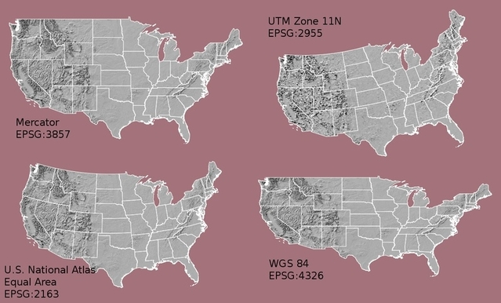
```

[Source](https://www.earthdatascience.org/courses/earth-analytics/spatial-data-r/intro-to-coordinate-reference-systems/)

---
- Because different CRS imply different ways of projections and generates substantially different visualizations, it is important to make sure the **CRS accompanied with each spatial data are the same** before implementing any advanced spatial analysis or geometric processing.
- In `sf`, we can use the function `st_crs()` to check the CRS used in one data.

```{r, eval=F}
library(sf)
st_crs(turkey)
```

- So, it uses [World Geodetic System](https://gisgeography.com/wgs84-world-geodetic-system/#:~:text=The%20Global%20Positioning%20System%20uses,mass%20as%20the%20coordinate%20origin) (WGS84) as CRS.
- [EPSG Codes](https://epsg.org/home.html): are also 4-5 digit numbers that represent CRS definitions. 

- A resource in Turkish: https://www.ktu.edu.tr/dosyalar/15_01_03_62773.pdf.

---
- The geographic coordinate system WGS84 (latitude, longitude) 
has an origin - (0,0, 0) - located at the intersection of the Equator (0° latitude) and Prime Meridian (0° longitude) on the globe.

```{r, echo=F, out.width="%5"}
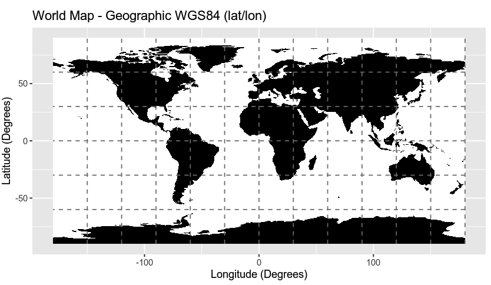
```

[Source](https://www.earthdatascience.org/courses/earth-analytics/spatial-data-r/geographic-vs-projected-coordinate-reference-systems-UTM/)

---
- Google Maps uses the [World Geodetic System WGS84](https://en.wikipedia.org/wiki/World_Geodetic_System) standard.

```{r, echo=F, out.width="%10", fig.link="https://developers.google.com/maps/documentation/javascript/coordinates"}

```

[Source](https://developers.google.com/maps/documentation/javascript/coordinates)


---
- For example, if you look up the geographic coordinates of Istanbul Technical University on [Google Maps](https://www.google.com/maps):

```{r, echo=F, out.width="%10", fig.link="https://www.google.com/maps/place/%C4%B0T%C3%9C+Matematik+M%C3%BChendisli%C4%9Fi+B%C3%B6l%C3%BCm%C3%BC/@41.106778,29.0220743,17z/data=!3m1!4b1!4m5!3m4!1s0x14cab52e0adf31d1:0xa0db5739235741dd!8m2!3d41.106778!4d29.024263?hl=en-US"}
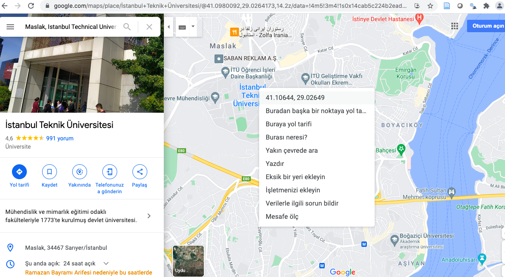
```

---
- More at: A nice resource on [EPSG and other CRS definition styles](https://www.earthdatascience.org/courses/earth-analytics/spatial-data-r/understand-epsg-wkt-and-other-crs-definition-file-types/).

---
#### Simple features
- [Simple features](https://r-spatial.github.io/sf/articles/sf1.html) refers to an international standard (ISO 19125-1:2004) that describes how real-world objects and their spatial geometries are represented in **computers**.
- This standard is enabled in [ESRI](https://www.esri.com/en-us/home)/[ArcGIS](https://www.arcgis.com/index.html) architecture, [POSTGIS](https://postgis.net/) (a spatial extension for PostGresSQL), the [GDAL](https://gdal.org/) libraries that serve as underpinnings to most GIS work.

---
- The following simple feature types are the most common:

```{css echo=FALSE}
.pull-left {
  float: left;
  width: 80%;
}
.pull-right {
  float: right;
  width: 20%;
}
```

.pull-left[
```{r, echo=F, out.width="%100"}
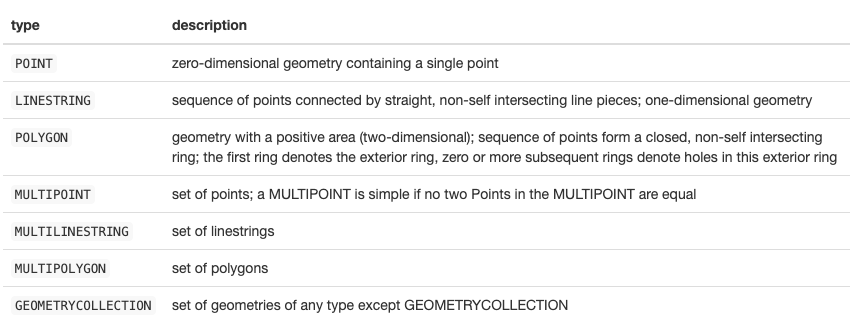
```
]

.pull-right[
```{r, echo=F, out.width="%80"}
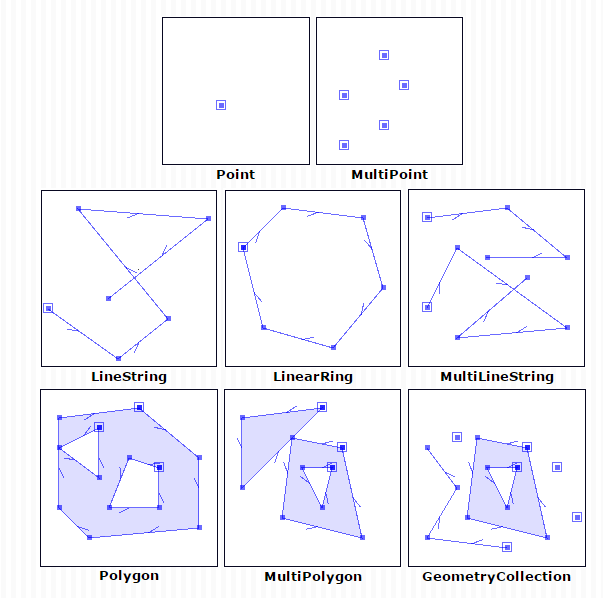
```
]
---
class: middle, center

```{r, echo=F, out.width="%100"}
knitr::include_graphics("logo/sf.gif")
```
---
#### R package sf
- The `R` package [sf](https://r-spatial.github.io/sf/) implements **Simple Features** that specifies a storage for spatial geometries (point, line, polygon).
- The `sf` package makes **simple features** even more accessible so that simple feature objects in spatial data are also stored in a data frame, with **one vector/column** containing geographic data (usually named “geometry” or “geom”).
- The `sf` package interfaces to:
   -  [GEOS](https://trac.osgeo.org/geos) to support geometrical operations including the DE9-IM,
   -  [GDAL](https://gdal.org/) supporting all driver options, Date and POSIXct and list-columns, and
   -  [PRØJ](https://proj.org/) for coordinate reference system conversions and transformations.
- You can install and load the `sf` package with the following commands:

```{r}
#if you experience difficulties in installation,
##do some googling!
#install.packages(sf)
library(sf)
```

---
- All functions and methods in `sf` package that operate on **spatial data** are prefixed 
by `st_*()`, which refers to **spatial type**.
- Most commonly used functions in the `sf` package are:

|Function              |Description                                  | 
|----------------------|---------------------------------------------|
|`st_read()`           | Read simple features from a file or database and their geometry. |
|`st_geometry_type()`  | Return geometry type of an object, as a factor. |
|`st_geometry()`       | Get, set, or replace geometry from an sf object. |
|`st_crs()`            | Retrieve coordinate reference system from sf object. | 
|`merge()`             | Merge a spatial object with a data.frame (i.e. merging of non-spatial attributes).|
|`gather()`            | `pivot_longer()` version of `sf` library.|
|`geom_sf()`           | Visualize simple feature (sf) objects. |
|`st_as_sf()`          | Create a sf object from a non-geospatial tabular data frame.|
|`st_write()`          | Write simple features object to file or database.|
|`st_drop_geometry`    | Drops the geometry of the spatial object. |


---
#### Turkey's Second-level Administrative Divisions
- Let's download and import the Turkey's **polygon shapefile**
which contains the second-level administrative divisions (adm2) 
from https://data.humdata.org/dataset/turkey-administrative-boundaries-levels-0-1-2.


```{r, eval=F}
library(sf)
turkey2 <- st_read("data/turkey_administrativelevels0_1_2/tur_polbna_adm2.shp")
```

---
- Check the object class type and geometry type!..

```{r, eval=F}
class(turkey2)
```


```{r, eval=F}
st_geometry_type(turkey2)
```

- Check the content of the data frame!..

```{r, eval=F}
View(turkey2)
```

- Get an overwiew of Turkey's map.

```{r, eval=F}
plot(st_geometry(turkey2))
```

- Check CRS type of this spatial data frame.

```{r, eval=F}
st_crs(turkey2)
```

---
- Let's focus on Istanbul now!..

```{r, eval=F, warning=F, message=FALSE}
library(sf)
library(dplyr)
istanbul_sf <- turkey2 %>% 
                  filter(adm1_tr == "İSTANBUL") %>% 
                  rename(District = adm2_tr) 
View(istanbul_sf) #returns 39 ilçe.
```

- Select the District column only (**geometry column automatically comes in**).

```{r, eval=F}
istanbul_sf <- istanbul_sf %>% 
                 select(District) %>% 
                 arrange(District)
View(istanbul_sf)
```

---
- Get a base map of Istanbul city!.

```{r, eval=F}
plot(st_geometry(istanbul_sf))
```

---
class: middle, center

#### IBB  Open Data Portal

```{r, echo=F, out.width="%100", fig.link="https://data.ibb.gov.tr/"}

```

[Source](https://data.ibb.gov.tr/)
---
#### Istanbul Metropolitan Municipality Open Data Portal

- Let's download and import the data set named "İlçe, Yıl ve Atık Türü Bazında Atık Miktarı"
at https://data.ibb.gov.tr/. 
- Note that this a traditional data frame (not a spatial data frame). 

```{r, eval=F, warning=F, message=F}
library(dplyr)
#https://data.ibb.gov.tr/dataset/ilce-yil-ve-atik-turu-bazinda-atik-miktari
library(readxl)
waste <- readxl::read_xlsx("data/ilce-yl-ve-atk-turu-baznda-atk-miktar-2021.xlsx", 
                               sheet = "Evsel Atık Miktarı", skip = 1) 
#skip 1st row only. The next row stands for column names.
```

- Let's see the content of the data set!..

```{r, eval=F}
View(waste) #returns 39 ilçe. 
```

---
- Do some tidying.

```{r, eval=F}
waste_ist <- waste %>% 
              select(-"Veri Türü (Data Type)") %>% #exclude this column
              setNames(c("District", paste("y", 2004:2020, sep=""))) #rename columns #names of columns should start with a letter.
```


```{r, eval=F}
View(waste_ist)
```

---
- Check the column names of `istanbul_sf` and `waste_ist` since two data sets
are coming from two different sources.

```{r, eval=F}
####
#they are not in the same order.
cbind(istanbul_sf$District, waste_ist$District)
```


```{r, eval=F}
#adjust inconsistencies
istanbul_sf[c(5:6,31:35),] <- istanbul_sf[c(6,5,32,34,35,31,33),]
```

```{r, eval=F}
#now they are in the same order
cbind(istanbul_sf$District,waste_ist$District)
```

```{r, eval=F}
#keep the name the same now.
istanbul_sf[,"District"] <- waste_ist[,"District"] 
```

---
- Now, merge **istanbul_sf** and **atik_2020** data sets by District column first.

```{r, eval=F}
waste_ist_sf <- merge(istanbul_sf, waste_ist) 
```

```{r, eval=F}
View(waste_ist_sf) 
```


```{r, eval=F}
class(waste_ist_sf)
```

---
- Let's get the population of each ilce from https://www.nufusu.com/ilceleri/istanbul-ilceleri-nufusu.

```{r, eval=F}
library(rvest)
url <- "https://www.nufusu.com/ilceleri/istanbul-ilceleri-nufusu"

ilce_pop <- read_html(url) %>% 
                html_nodes("table")%>% 
                html_table() %>% .[[1]]  
```

```{r, eval=F}
View(ilce_pop) #returns 39 ilçe. Turkish letters are not consistent.
```

---
- Create a District column and Population column. 

```{r, eval=F}
ilce_pop2 <- ilce_pop %>% 
               select("District" = "İlçe", "Pop_2020" = "Toplam Nüfus") %>% 
                 arrange(District)  #silivri coordinates are not available.
```


```{r, eval=F}
View(ilce_pop2) 
```

---
- Check the name consistencies!..

```{r, eval=F}
#they are in the same order, but there are inconsistencies in Turkish characters.
cbind(waste_ist_sf$District, ilce_pop2$District)
```

- Get the names from ilce_pop2 frame

```{r, eval=F}
waste_ist_sf[,"District"] <- ilce_pop2[,"District"] 
#istanbul_atik$District <- ilce_pop2$District
```

- Merge the `ilce_pop2` data frame with `istanbul_atik` and calculate
an **additional column** which calculates the amount of waste per
person for each ilce in 2020.

```{r, eval=F}
waste_pop_ist_sf <- waste_ist_sf %>% 
                      merge(ilce_pop2, by = "District") %>% 
                       mutate(per = y2020/Pop_2020) 
```

```{r, eval=F}
class(waste_pop_ist_sf )
```

```{r, eval=F}
View(waste_pop_ist_sf)
```

---

```{r, eval=F}
library(dplyr)
library(ggplot2)
library(viridis)
waste_pop_ist_sf %>% 
  ggplot() +
  geom_sf(aes(fill = per), color = "black") +  
  scale_fill_viridis("Range", direction = -1) + #reverse the color direction
  ggtitle("İstanbul İlçe Bazında Kişi Başına Düşen Atık Miktarı") +
  geom_sf_text(data=subset(waste_pop_ist_sf, per > 500), 
              aes(label = District), color = "Black") +
  theme_void() + #avoids latitude and longitude information
  #theme_bw() +
  theme(title = element_text(face="bold")) 
#https://cran.r-project.org/web/packages/viridis/vignettes/intro-to-viridis.html
#https://seaborn.pydata.org/tutorial/color_palettes.html
```

---
#### Geocoding
- **Geocoding** is the process of converting addresses (like a street address) into geographic coordinates using a known CRS.
- We can then use these geographic coordinates (such as latitude, longitude) to spatially enable our data.
- This means we convert to a spatial data frame (sf) within `R` for spatial analysis
and then save as a shapefile (a spatial data format) for future use. 

---
#### Example: Universities in Istanbul
- We will use `university.xlsx` file which includes
data related to some leading universities in Istanbul, but not geographic coordinates.
- To get a geographic coordinate for each university, we need to **geocode**. 

```{r, eval=F}
university <- readxl::read_xlsx("data/university.xlsx")
university
```

- Let's see the content of `university` data set. 

```{r, eval=F}
View(university)
```

---
class: middle, center

```{r, echo=F, out.width="%5"}
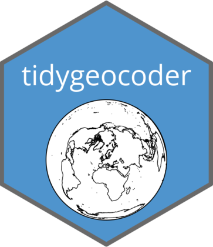
``` 

---
#### R package tidygeocoder
- The [tidygeocoder](https://cran.r-project.org/web/packages/tidygeocoder/vignettes/tidygeocoder.html) package uses multiple geocoding services to geocode the locations, providing the user with an option to choose. 
- Let's install and load the `tidygeocoder` package.

```{r, eval=F}
#install.packages("tidygeocoder")
library(tidygeocoder)
```

---
- Let’s test the service by starting with one address with the function `geo(address, lat, long, method)`:
- The function `geo(address, lat, long, method = cascade)` also provides the option to use a `cascade` method which queries other geocoding services **in case the default method fails to provide coordinates**.

```{r, eval=F}
###The default method used here is US Census geocoder.
###https://geocoding.geo.census.gov/
###I use method = "cascade" since my address is out of US.
library(tidygeocoder)
sample <- geo(address = "Maslak, Sarıyer, 34467, İstanbul, Turkey", 
              lat = latitude, #return a latitude column
              long = longitude,  #return a longitude column
              method = 'cascade')
sample
```

```{r, eval=F}
# a usual data frame
class(sample)
```

- Please, get familiar with the input parameters, expected output, and review the documentation further if needed.

---
- To apply the function to multiple addresses, we first we need ensure that we have a **character vector of full addresses**.

```{r, warning=F, message=F, eval=F}
###we need ensure that we have a character vector of full addresses.
str(university)
```

- Let's convert university type variable into a factor, and combine
Neighborhood, Postal_Code, District, City, Country variables into a single full address!


```{r, warning=F, message=F, eval=F}
library(dplyr)

university_long <- university %>%
                     mutate(Type = as.factor(Type)) %>% 
                     mutate(full_adress = paste(Neighborhood, Postal_Code, District, City, Country))
                     
glimpse(university_long)
                      
```

---
#### Batch Coding
- Now we are ready to geocode the addresses. Note that geocoding takes a bit of time.

```{r, eval=F}
geo_coded_university <- university_long %>% 
                          geocode(address = 'full_adress', 
                                  lat = latitude, #return a latitude column
                                  long = longitude, #return a longitude column
                                  method = 'cascade')
```

- The returned “tibble” data structure below shows us the address, latitude, longitude and also the geocoding service used to get the coordinates. 

```{r, eval=F}
View(geo_coded_university)
```

---
#### Convert to Spatial Data
- While we have geographic coordinates loaded in our data, it is still not **spatially enabled**. 
- To convert to a spatial data format, we have to enable to coordinate reference system that 
connects the **latitude and longitude recorded to actual points on Earth**.
- There are thousands of ways to model the Earth, and each requires a different spatial reference system. 
- This is a very complicated domain of spatial applications, but for our purposes, we simplify by using a geodetic CRS that uses coordinates longitude and latitude.
- The lat/long coordinates provided by the geocoding service above report data by using World Geodetic System (WGS84) model with
EPSG Code **4326**. 

---
#### Convert a foreign object to an sf object
- Next we convert our data frame to a spatial data frame using the `st_as_sf()` function. 
- The `coords` argument specifies which two columns are the X and Y for your data. 
- We set the `crs` argument equal to `4326`.

```{r, eval=F}
library(sf)
#The first argument is the object to be converted into an object class sf
#coords:names or numbers of the numeric columns holding coordinates
#The X, Y field actually refers to longitude, latitude, respectively.
university_Sf <- st_as_sf(geo_coded_university, 
                          coords = c("longitude", "latitude"),
                          crs = 4326)
```

- Check the class of the university_sf object.

```{r, eval=F}
class(university_Sf)
```

- Check the geometry type of the university_sf object.

```{r, eval=F}
st_geometry_type(university_Sf)
```

- In `sf` spatial objects are stored as a simple data frame with a special column that contains the information for the **geometry coordinates**. 

```{r, eval=F}
View(university_Sf)
```

- Pay attention to the coordinates (furthermore, latitude and longitude columns have disappeared!)

---
#### Save Shape Data
- Finally, we can save this spatial dataframe as a shapefile which can be used for further spatial analysis.

```{r, warning=F, message=F, eval=F}
write_sf(university_Sf, "data/university.shp")
```

---
#### Visualize Points

```{r, eval=F}
library(tmap)
tmap_mode("view")
```

- Next, we plot our points as dots and color the locations by university type.

```{r, eval=F}
library(tmap)
university_Sf %>% 
tm_shape() + 
  tm_dots(col = "Type") 
```

---
#### Recommended reading
```{css echo=FALSE}
.pull-left {
  float: left;
  width: 50%;
}
.pull-right {
  float: right;
  width: 50%;
}
```

.pull-left[
```{r, echo=F, out.width="%100"}
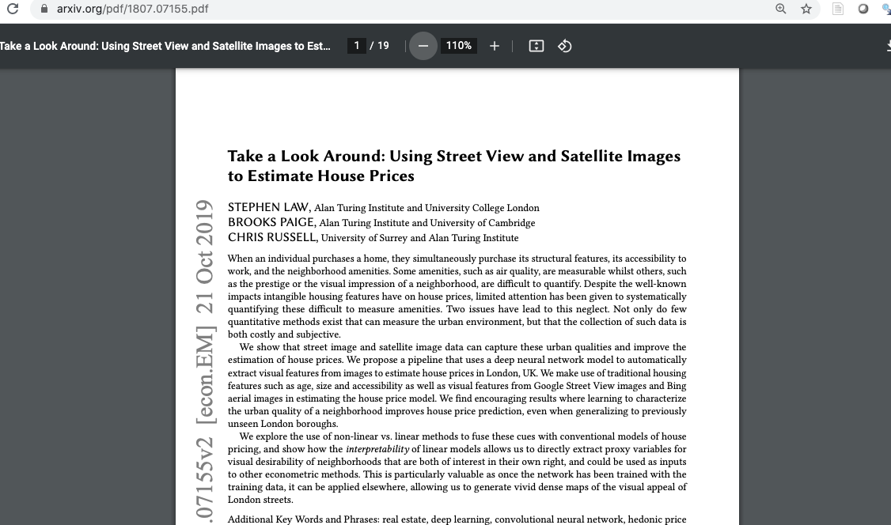
``` 
]

.pull-right[
```{r, echo=F, out.width="%100"}
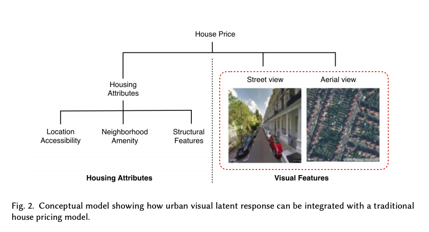
``` 
]

[Source](https://arxiv.org/pdf/1807.07155.pdf)

---
class: middle, center

#### Fairness in maps

```{r, echo=F, out.width="%50", fig.link="https://www.dailysabah.com/technology/2016/02/19/google-maps-adds-turkish-republic-of-northern-cyprus"}
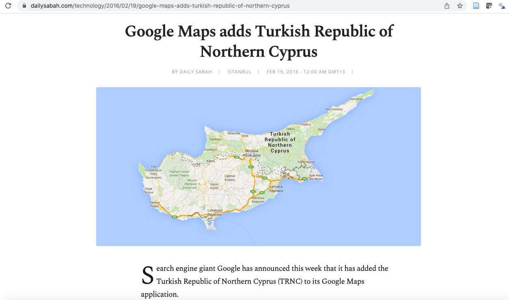
``` 

---
class: middle, center
#### Fairness in maps

```{r, echo=F, out.width="%50", fig.link="https://www.bbc.com/news/blogs-trending-47171599"}
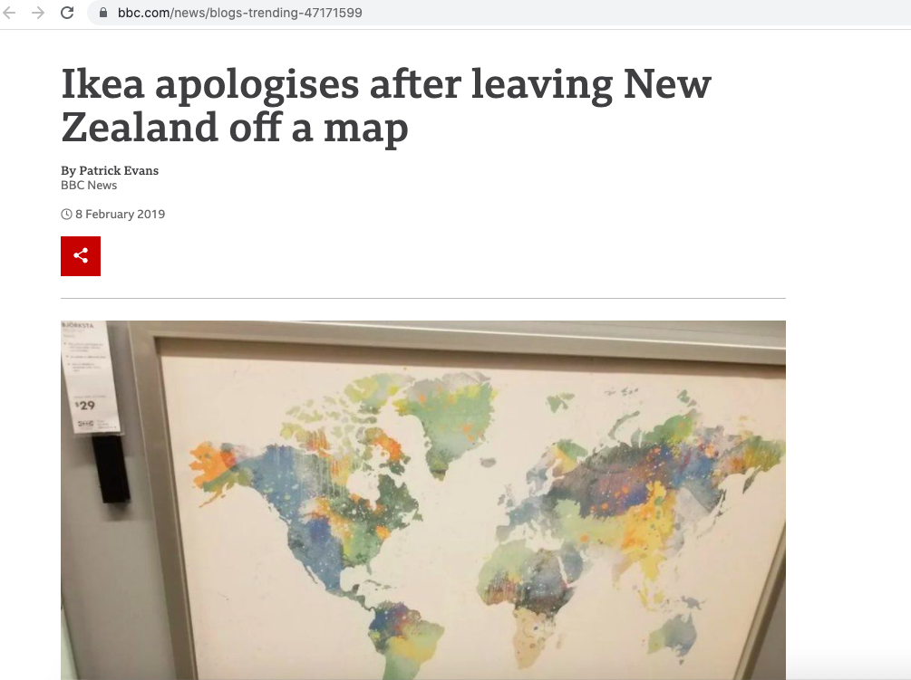
``` 

---
class: middle, center

#### A mini series on how Google Earth launched (click on image below)

```{r, echo=F, out.width="%100", fig.link="https://www.imdb.com/video/vi4021142297?playlistId=tt15392100&ref_=tt_ov_vi"}

``` 

---
class: middle, center

#### Definition of "Spatial" is changing...

<iframe width="830" height="467" src="https://www.youtube.com/embed/dcNbSywXlpk" title="YouTube video player" frameborder="0" allow="accelerometer; autoplay; clipboard-write; encrypted-media; gyroscope; picture-in-picture" allowfullscreen></iframe>

---
class: middle, center

#### Last but not least: Accessibility

<iframe width="745" height="419" src="https://www.youtube.com/embed/-oWsAMwJ-ks" title="YouTube video player" frameborder="0" allow="accelerometer; autoplay; clipboard-write; encrypted-media; gyroscope; picture-in-picture" allowfullscreen></iframe>


---

#### Attributions
- https://cengel.github.io/R-spatial/spatialops.html
- https://cengel.github.io/R-spatial/mapping.html#plotting-simple-features-sf-with-plot
- https://www.youtube.com/playlist?list=PLf9p4wbX01Asvw3XG55kuHvgA4SXZvvgw

