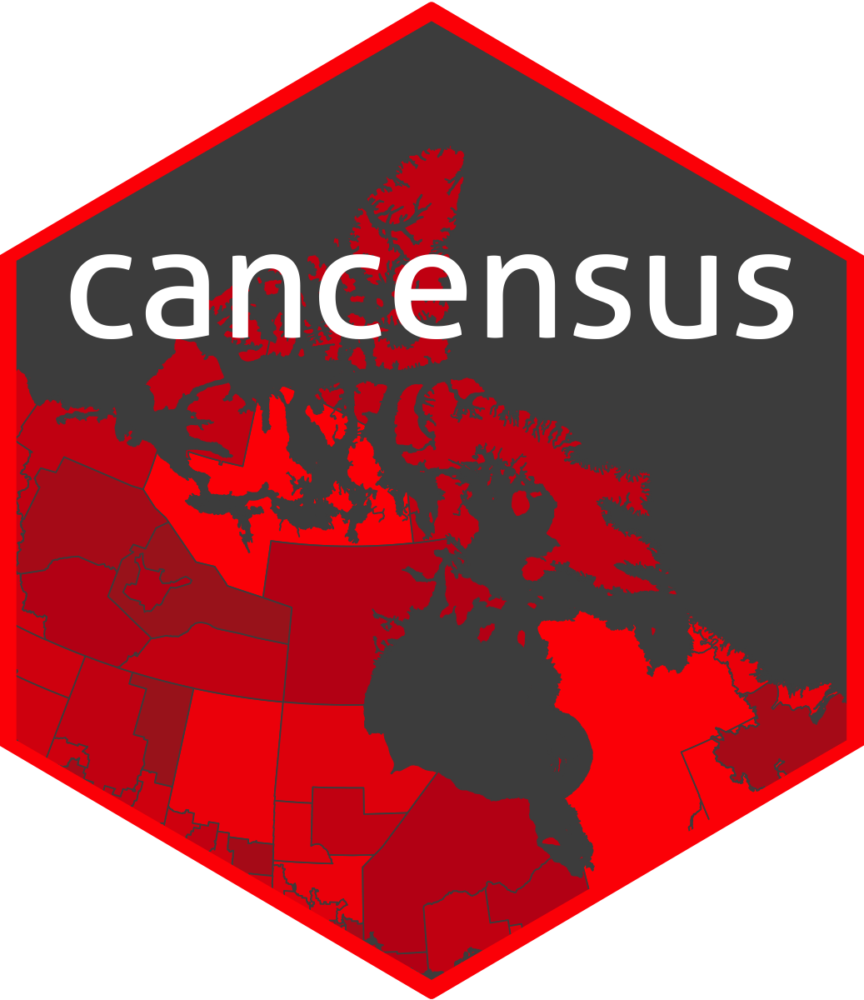
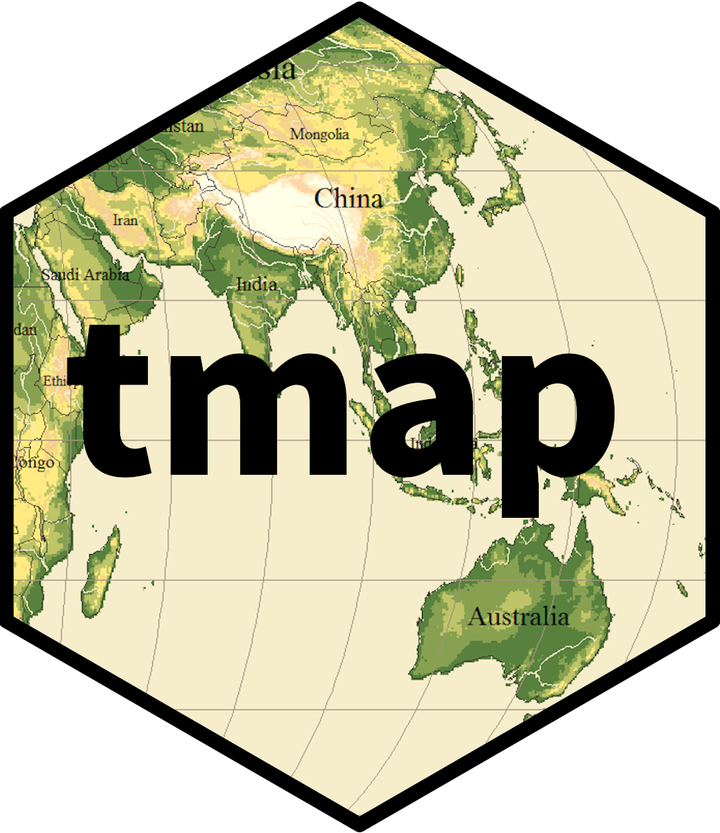

#### Canada Census Data 

- Every five years, Canadians are invited to participate in the census to help paint a portrait of Canada's diverse population and the places where they live.
- The [Canadian 2021 Census](https://www12.statcan.gc.ca/census-recensement/2021/ref/98-26-0001/982600012020001-eng.pdf) was held on May 11, 2021 by [Statistics Canada](https://www12.statcan.gc.ca/census-recensement/index-eng.cfm).
- The Census collects information on the population, age, sex at birth and gender, type of dwelling, families, households and marital status, Canadian military experience, income, language, Indigenous peoples, housing, immigration, place of birth and citizenship, ethnocultural and religious diversity, mobility and migration, education, and labour.
- The responses are vital to the community for planning services that support employment, schools, public transportation, and hospitals. 

#### Census Mapper

- [CensusMapper](https://censusmapper.ca/) databases store all publicly available data from [Statistics Canada](https://www12.statcan.gc.ca/census-recensement/index-eng.cfm) for the 2006, 2011, and 2016 Censuses. 
- Please, take a look at map of "Median total income of economic families in 2015" at https://censusmapper.ca/.

#### R package cancensus 

```{r, out.width="%10"}

```

- The [`R cancensus`](https://mountainmath.github.io/cancensus/index.html) package was developed to provide users with a way to access **Canadian Census** in a programmatic way following **tidy data principles**. 

- The package `cancensus` retrieves **Census data** indirectly through the [CensusMapper API](https://censusmapper.ca/) to access **Censusmapper data**.

- The stable version of `cancensus` can be easily installed from `CRAN`.

```{r}
#install.packages(cancensus)
library(cancensus)
```

#### API Key

- The R `cancensus` package requires a valid [CensusMapper API](https://censusmapper.ca/) key to use. 
- You can obtain a **free API key** by [signing up](https://censusmapper.ca/users/sign_up) 
for a CensusMapper account. 
- To check your API key, just go to “Edit Profile” (in the top-right of the CensusMapper menu bar). 
- Once you have your key, you can store it in your system environment so it is automatically used in API calls. 
- To do so just enter: 

```{r}
#Cancensus requires a free Censusmapper API key to retrieve data. 
#This function helps set the key for either the duration of the session 
#(default) or permamently for use across sessions.
set_api_key("CensusMapper_f9a6d1b394f6a00ccce14eb921649047", overwrite=TRUE, install = TRUE)
```

### Retrieve Data

- The R `cancensus` package retrieves census data with the `get_census()` function. 
- The function `get_census()` can take a number of arguments, the most important of them 
  are `dataset`, `regions`, and `vectors`, which have no defaults. 
- Thus, in order to be able to retrieve census data, you’ll first need to figure out:

  - your data set, 
  - your region(s), and
  - your data vector(s) (census question variables).

#### List available census data sets

- We can run `list_census_datasets()` to check what data sets are currently available for access through the **CensusMapper API**.

```{r}
View(list_census_datasets())
```

#### Find Census Regions

- Next, let’s find the **regions** that we’ll be getting the data for. 
- To search for census regions, use the `search_census_regions()` function.
- Let’s take a look at what region search returns for **Toronto** for **CA11** data set.

```{r}
View(search_census_regions(searchterm = "Toronto",   dataset = "CA11"))
```

- Look at the column ‘level’ for the answer. Often, the same geographic region can be represented by several census levels, as is the case here. There are three levels for Toronto, which is simultaneously a census metropolitan area, a census division, and a census sub-division.
- Choose the geographic level with the **level** argument, which can take the following values: ‘C’ for Canada (national level), ‘PR’ for province, ‘CMA’ for census metropolitan area, ‘CD’ for census division, ‘CSD’ for census sub-division, or NA:

### Retrieve Data

- Let's get **2011 Census data** and **boundary files** for **Toronto** (CMA="35535")(http://www.yorku.ca/tiedi/doc/TrainingGeography.pdf) 
and **its neighborhoods**, respectively.

- The package `cancensus` retrieves Census geographic data as **GeoJSON objects** and 
then converts them into `sf` objects depending on the `geo_format` input argument within
`get_census()` function.

- Note that more info available at: https://www.r-bloggers.com/2020/03/working-with-statistics-canada-data-in-r-part-5-retrieving-census-data/.

```{r}
library(cancensus)
library(sf)
# retrieve sf dataframe
toronto11_sf <- get_census(dataset='CA11', 
                           regions=list(CMA="35535"),
                           level='CSD', quiet = TRUE, 
                           geo_format = 'sf', 
                           labels = 'short')
View(toronto11_sf)
```

#### Find Census Vectors

- If you do not specify any vector in `get_census()` function will return **geographic information only**.
- Canadian census data is made up of individual variables, aka **census vectors**. 
- Vector number(s) is another argument you need to specify in order to retrieve data with the
`get_census()` function.
- Let's investigate vectors available in the data set with `list_census_vectors("datasetname")`. 

```{r}
View(list_census_vectors(dataset = 'CA11'))
#vector label = v_CA11F_887 (Language spoken most often at home: Turkish) 
#Number of households speaking Turkish at home.
```

```{r}
View(list_census_vectors(dataset = 'CA16'))
#vector label = v_CA16_2117 (Language spoken most often at home: Turkish) 
#Number of households speaking Turkish at home.
```

#### Retrieve data one more time

- Now, let's get 2011 and 2016 Census Data for Toronto and its neighborhoods (including the attribute
"the number of households speaking Turkish" with vector labels **v_CA11F_887** and **v_CA16_2117**, respectively).


```{r}
library(cancensus)
library(sf)
# retrieve sf dataframe
toronto11_sf <- get_census(dataset = 'CA11', 
                           regions = list(CMA="35535"),
                           vectors = c("lang_TR_11"="v_CA11F_887"), #assign a name to the vector
                           level = 'CSD', quiet = TRUE, 
                           geo_format = 'sf', labels = 'short')
View(toronto11_sf)
```

```{r}
library(cancensus)
library(sf)
# retrieve sf dataframe
toronto16_sf <- get_census(dataset = 'CA16', 
                           regions = list(CMA="35535"),
                           vectors = c("lang_TR_16"="v_CA16_2117"), 
                           level = 'CSD', quiet = TRUE, 
                           geo_format = 'sf', labels = 'short')
View(toronto16_sf)
```

- Now, create a single census data set by merging "lang_TR" attribute 
(variable) in **2011 data** with **2016 data** based on the attribute "Region Name".

- Because of the `merge()` function available `sf` library, we need to first
drop the spatial property of **toronto11_sf** data set.

```{r}
merge(toronto11_sf, toronto16_sf, by = "Region Name")
```

- Note: my solution may not be the only solution. it can be solved through `st_union()`.

```{r, warning=F, message=F}
library(dplyr)
library(sf)
toronto11 <- toronto11_sf %>% 
              select("Region Name", "lang_TR_11") %>% 
              st_drop_geometry()
View(toronto11)
```

- Combine **toronto16_sf** and **toronto11** data sets, and drop NA's as well.

```{r}
library(tidyr)
toronto <- merge(toronto16_sf, toronto11, all = TRUE) %>% 
             drop_na()  #eliminates two rows, could not understand. row should be 24.
View(toronto)
```

```{r}
class(toronto)
```


#### Basic Mapping

#### Static Maps

- Static maps are the most common type of visual output for **geocomputation**. 
- The generic `plot()` function in `sf` library is often the fastest way to create static maps from vector spatial objects.

```{r}
?plot
```


#### Basic Mapping with plot() function

- What geometries are in the Toronto data? Can you make a quick map with plot()?

```{r}
st_geometry_type(toronto)
```

```{r}
plot(st_geometry(toronto))
```

- By default this `plot()` function of `sf` library creates a multi-panel plot, one sub-plot for each variable of the object.

```{r}
# If used without any arguments it will plot all the attributes.
plot(toronto)  
```

- We can specify the names of the attributes to be plotted as well.

```{r}
plot(toronto[c("lang_TR_11","lang_TR_16")])
```

- A legend or ‘key’ with a continuous color is produced if the object to be plotted has a single attribute.

```{r}
plot(toronto["lang_TR_16"])
```

```{r}
hist(toronto$lang_TR_16)
```

- Or we might prefer to set the breaks manually.

```{r}
#breaks: a numeric vector with the actual breaks	
plot(toronto["lang_TR_16"], 
     main = "Number of households speaking Turkish in 2016", 
     breaks = seq(0, 6000, by=2000))
```

- We can change the color palette using `RColorBrewer` package.
For more about ColorBrewer palettes read [this](https://colorbrewer2.org/#type=sequential&scheme=BuGn&n=3). 
- We can display available colors by `display.brewer.all()`.

```{r}
#install RcolorBrewer packages first
library(RColorBrewer)
#https://colorbrewer2.org/#type=sequential&scheme=BuGn&n=3
```

```{r}
# Using ColorBrewer to generate palette
display.brewer.all()
```

- To make the color palettes from `RColorBrewer` available as `R` palettes, 
we use the `brewer.pal()` function. 
- It takes two arguments: 
   - the number of different colors desired and 
   - the name of the palette as character string


```{r}
col_pal <- brewer.pal(n = 6, name = "Purples") # we select 6 colors from the palette #try: Oranges 
#it returns a character vector with HEX color numbers
#class(col_pal)
col_pal 
```

```{r}
#pal: palette argument
plot(toronto["lang_TR_16"], 
     main = "Number of households speaking Turkish", 
     breaks = seq(0, 6000, by = 1000),
     pal = col_pal)
```

- Plots are added as layers to **existing images** by setting add = TRUE
- For instance, plot the low-level (household number speaking Turkish < 50) 
and high-level (household number speaking Turkish < 2000) attributes on the Toronto map.

```{r}
library(dplyr)
toronto_low_sf  <- toronto %>% 
                   filter(lang_TR_16 < 50) 
```


```{r}
View(toronto_low_sf)
```

```{r}
library(dplyr)
toronto_high_sf <- toronto %>% 
                   filter(lang_TR_16 > 2000) 
```

```{r}
View(toronto_high_sf)
```

```{r}
#reset: if FALSE, keep the plot in a mode that allows adding further map elements.
plot(toronto["lang_TR_16"], main = "Number of households speaking Turkish", col="white", reset=FALSE)
plot(toronto_low_sf["lang_TR_16"], add = TRUE, col = "blue")
plot(toronto_high_sf["lang_TR_16"], add = TRUE, col = "red")
```


####Basic plotting with tmap package

```{r, out.width="%10"}

```

- The R package [`tmap`(thematic maps)](https://cran.r-project.org/web/packages/tmap/vignettes/tmap-getstarted.html)
is a powerful and flexible map-making package that allows for the creation of **static** and **interactive maps**.
- The syntax for creating plots is similar to that of ggplot2, but tailored to maps. 
- Visit https://cran.r-project.org/web/packages/tmap/vignettes/tmap-getstarted.html for further documentation.
- Install and load the library first:

```{r}
#install.package("tmap")
library(tmap)
```

- The basic building block is `tm_shape()` (which takes input spatial data), 
followed by one or more layer elements such as `tm_polygons()`.

- For a wide range of functions available in `tmap` package, type:

```{r}
help("tmap-element")
```

- Plot the **lang_TR_16** attribute over the Toronto map.

```{r, message=FALSE, warning=F}
# tm_shape():Creates a tmap-element that specifies a spatial data object, which we refer to as shape
library(dplyr)
toronto %>% 
tm_shape() +  ##like ggplot() main call.
  tm_polygons(col = "lang_TR_16") 
#tm_polygons(): accepts either a single color value
#or the name of a data variable that is contained in shp.
```

- There are multiple ways to do the same thing in R! In this case, 
`tm_polygons()` is a superset of `tm_fill()` and `tm_borders()`.

tm_polygons()  == tm_fill() + tm_borders()


```{r}
library(dplyr)
toronto %>% 
  tm_shape() +
  tm_fill(col = "lang_TR_16") + #Create a polygon layer (without borders)
  tm_borders()  # Add border layer
```

- The object passed to `tm_shape()` in this case is `Toronto` an `sf` object 
representing the regions of Toronto and its surrounding.
- Layers are added to represent Toronto visually, with `tm_fill()` and `tm_borders()` 
creating shaded areas and border outlines. 

- `tm_fill()` + `tm_borders()` is more flexible comparted to `tm_polygons()`.


#### Changing Aesthetics

- The plots in the previous examples demonstrate `tmap`’s default aesthetic settings. 

- There are two main types of map aesthetics: 
  - those that are **constant**.
  - those that **change with the attribute (variable)** and 
  
- Of course, these default values and other aesthetics can be overridden.

- The most commonly used aesthetics for `tm_fill` layer include: 
 
  - `col`  : color and
  - `alpha`: transparency. 

- The most commonly used aesthetics for `tm_borders` layers include:   
  
  - `col`  : color,
  - `alpha`: transparency, 
  - `lwd`  : line width, and 
  - `lty`  : line type.

- The impact of these settings with **fixed values** is illustrated as follows:

```{r}
library(tmap)
map1 <- tm_shape(toronto) + 
         tm_fill(col = "red")  #no variable
map1
```


```{r}
map2 <- tm_shape(toronto) + 
           tm_fill(col = "red", alpha = 0.1) #no variable

map2
```


```{r}
map3 <- tm_shape(toronto) + 
          tm_borders(col = "blue", lwd = 3 , lty ="dashed")
map3
``` 

```{r}
map4 <- tm_shape(toronto) + 
          tm_fill(col = "lang_TR_16", alpha = 0.5) + #mapping with a variable brings a legend
           tm_borders(col = "black", lwd = 3, lty = "dashed")
map4
```

```{r}
tmap_arrange(map1, map2, map3, map4)
```


- An important argument in functions defining aesthetic layers such as `tm_fill()` is title, 
which sets the **title of the associated legend**.


```{r}
map5 <-tm_shape(toronto) + 
      tm_fill(col = "lang_TR_16", title = "Household range") + 
      tm_borders(col = "black", lwd = 3, lty = "dashed")
map5
```


#### Color settings

- Color settings are an important part of map design. 
- They can have a major impact on how spatial variability is portrayed. 
- This following shows four input arguments of coloring regions in Toronto depending on number of households speaking Turkish in 2016 within `tm_fill()` layer:
   -  `style`: refers to the classification method that should be used to “bin” the data.
      Options: kmeans, quantile, jenks, pretty, equal, sd.
   -  `breaks`: allows you to manually set the breaks, and
   -  `n`: sets the number of bins into which numeric variables are categorized
   
   
```{r}
library(tmap)
ma6 <- tm_shape(toronto) + 
             tm_fill(col = "lang_TR_16",   
                     #style ="kmeans", #style: kmeans, quantile, jenks, pretty etc 
                     breaks =   c(0, 2, 4,  6) * 1000,  # breaks =   c(0, 3  6) * 1000
                     #n = 2,
                     title = "Household range") + 
             tm_borders(col= "black")
ma6 
```  
  
   
   -  `palette`: defines the color scheme associated with the bins and determined by the breaks and n.
It expects a vector of colors or a new color palette name, which can be selected interactively with `tmaptools::palette_explorer()`. You can add a - as prefix to reverse the palette order.
- To run this you’ll need to make sure you have the `shiny` and `shinyjs` packages installed. 
- You can also run `display.brewer.all()` in your console to view the Color Brewer palettes.

```{r}
library(shiny)
library(shinyjs)
tmaptools::palette_explorer()
```

```{r}
library(tmap)
map7 <- tm_shape(toronto) + 
             tm_fill(col = "lang_TR_16", 
                     style = "pretty",  #try: kmeans, quantile, jenks, pretty etc
                     palette = "BuPu", 
                     title = "Household range")
map7 
```


```{r}
library(tmap)
map8 <- tm_shape(toronto) + 
       tm_fill(col = "lang_TR_16", 
               breaks = c(0, 1, 2, 3, 4, 5, 6) * 1000,
               palette = "BuPu",
               title = "Household range") 
map8
```


```{r}
library(tmap)
map9 <- tm_shape(toronto) + 
       tm_fill(col = "lang_TR_16", 
               n = 3,
               palette = "BuPu",
               title = "Household range")
map9
```


```{r}
library(tmap)
map10 <- tm_shape(toronto) + 
       tm_fill(col = "lang_TR_16", 
               n = 3,
               palette = "-BuPu", #reverse the color order
               title = "Household range")

map10
```


#### Map layout
- The map layout refers to the combination of all map elements into a map. 
- Map elements include among others the objects to be mapped, the **title**, the scale bar, 
margins and aspect ratios**.
- The title of the **main plot** can be defined with `tm_layout()`.
(see args(tm_layout) or ?tm_layout for a full list).

```{r}
?tm_layout()
```

```{r, message=F, warning=F}
#tm_layout() refers to theme() layer in ggplot2
library(dplyr)
map11 <- toronto %>% 
          tm_shape() +
          tm_fill(col = "lang_TR_16", 
                  palette = "BuPu", 
                  title = "Household range") + 
          tm_borders() +
          tm_layout(title = "Number of households speaking Turkish in Canada", 
                    title.size = 1.5, 
                    title.fontface = "bold",
                    legend.title.size = 0.6,
                    legend.outside = TRUE)

map11
```


- Beyond the low-level control over layouts and colors, `tmap` also offers high-level styles, using the `tm_style()`. 
- Some styles such as tm_style("cobalt") result in stylized maps, while others such as tm_style("gray") make more subtle changes, as illustrated below:


```{r}
?tm_style() #bw #classic #cobalt 
```

```{r}
map12 <- map11 + tm_style(style = "bw")
map13 <- map11 + tm_style(style = "classic")
map14 <- map11 + tm_style(style = "cobalt")
map15 <- map11 + tm_style(style = "col_blind")

tmap_arrange(map12, map13, map14, map15)
```


#### Faceted Maps

- Faceted maps, also referred to as ‘small multiples’, are composed of **many maps arranged side-by-side**. 
- **Facets** enable the visualization of **how spatial relationships change** with respect to another variable, **such as time**. 
- The changing populations of settlements, for example, can be represented in a faceted map with each panel representing the population at a particular moment in time. 
- Typically all individual facets in a faceted map contain the **same geometry data repeated multiple times**, once for each column in the attribute data.

- Let's plot the "number of households speaking Turkish" over the years 2011 and 2016.

```{r}
#pivot_longer is not compatible
#with sf objects.
#https://github.com/r-spatial/sf/issues/1149
library(tidyr)
map_time <- toronto %>% 
              select("name", "lang_TR_11", "lang_TR_16") 
View(map_time)
#select keeps the geometry regardless of whether it is selected or not
```

```{r}
library(tidyr)
#23*2=46 rows
map_time_long <- map_time %>% 
                   gather(year, lang_TR, -name, -geometry) 
                   #do not touch name and geometry columns.
                   #create two long variables: year and lang_TR
                
View(map_time_long)
```


```{r}
str(map_time_long)
```

- Lastly, turn year variable into a numeric one.

```{r}
map_time_toronto <- map_time_long %>% 
                    mutate(year = case_when( (year == "lang_TR_11") ~ "2011",
                                             (year == "lang_TR_16") ~ "2016")) %>% 
                    mutate(year = as.numeric(year))
View(map_time_toronto)
```

```{r}
class(map_time_toronto)
```

- We will do faceting by `tm_facets()` layer. 
- The key features of faceted maps created with `tm_facets()` function:
   - The `by` argument which varies depending on a variable (year in this case).
   - The `nrow/ncol` setting specifying the number of rows and columns that facets should be arranged into
   - The `free.coords` parameter specifying if each map has its own bounding box.

```{r}
facet_map <- map_time_toronto %>% 
              mutate(new_name = ifelse(lang_TR >= 5000, as.character(name), "")) %>% 
                tm_shape() +
                tm_fill(col = "lang_TR", 
                        style = "kmeans",  #n=5 --> seems does not work good enough.
                        palette = "Blues",
                        title = "Household range") +
                tm_borders()  +
                tm_facets(by = "year", nrow = 1, free.coords = TRUE) +
                tm_layout(main.title = "Number of households speaking Turkish in Toronto area over years",
                          panel.labels = c('Year 2011','Year 2016'),
                          panel.label.size = 1.0, panel.label.color = 'white',
                          panel.label.bg.color = '#005b96', panel.label.height = 1.0) +
                tm_text("new_name", col = "black", size = 0.5)
             
facet_map 
```


#### Adding new shapes

- Let's add the location of Turkish Consulate General in Toronto (https://www.google.com/maps/place/T%C3%BCrkiye+Cumhuriyeti+Toronto+Ba%C5%9Fkonsoloslu%C4%9Fu/@43.6378363,-79.3924769,15z/data=!4m5!3m4!1s0x0:0x97ae920fff5a110f!8m2!3d43.6377842!4d-79.3924044) 
onto our map.

```{r}
# Create a simple geographic object with one point
point <- data.frame("loc_name" = c("Turkish Consulate General in Toronto"), 
                     lat = c(43.63845746746079), 
                     long = c(-79.3923696116396))
point
```

```{r}
sites <- st_as_sf(point, coords = c("long", "lat"), crs = 4326)
```

```{r}
facet_map +
  tm_shape(sites) +  #get the point sf object
   tm_bubbles(size = 0.5, col = "red") +
    tm_text("loc_name", size = 0.5)
```


#### Adding a basemap

- If you want a basemap for your map, change the `tmap_mode` to “view”.

```{r}
tmap_mode("view")
```


```{r}
facet_map +
  tm_shape(sites) +  #get the point sf object
   tm_bubbles(size = 0.5, col = "red") +
    tm_text("loc_name", size = 0.5)
```

- `R` can connect to other map servers. 
-  We can preview basemaps and find their names at this [Leaflet Provider Demo] (https://leaflet-extras.github.io/leaflet-providers/preview/). 
-  We can also pull up a list of all the providers with `leaflet::providers`.


```{r}
leaflet::providers
```

```{r}
facet_map +
  tm_shape(sites) +  #get the point sf object
   tm_bubbles(size = 0.5, col = "red") +
    tm_text("loc_name", size = 0.5) +
   tm_basemap(server = "OpenStreetMap") #OpenStreetMap.HOT
```

# tmap_save() saves interactive plots (currently does not support facets)


##At home
#### Animated Maps 

-  In addition to their utility for showing changing spatial relationships, 
**faceted maps** are also useful as the foundation for animated maps by using
`along` argument in `tm_facets()` function.
  

```{r}
#install.packages("gifski")
library(gifski)
map <-  map_time_toronto %>% 
              mutate(new_name = ifelse(lang_TR >= 5000, as.character(name), "")) %>% 
                tm_shape() +
                tm_fill(col = "lang_TR", 
                       style = "quantile",  #n=5 --> seems does not work good enough.
                       palette = "Blues",
                       title = "Household range") +
                tm_borders()  +
                tm_facets(along = "year", free.coords = TRUE) +
                tm_layout(main.title = "Number of households speaking Turkish in Toronto area over years",
                          title.size = 0.5,  #confused with the font size.
                          panel.labels = c('Year 2011','Year 2016'),
                          panel.label.size = 1.0, panel.label.color = 'white',
                          panel.label.bg.color = '#005b96', panel.label.height = 1.0) +
                tm_text("new_name", size = 0.5)

tmap_animation(map, filename = "data/toronto.gif", delay = 25)  #check data directory!.           
```


#### More at:

- https://waterdata.usgs.gov/blog/
  - https://waterdata.usgs.gov/blog/build-r-animations/
- https://github.com/milos-agathon/unemployment_europe_map
- https://github.com/milos-agathon/protest_map
- https://walker-data.com/paa2021/#16
- A New York times example: https://www.washingtonpost.com/weather/2021/02/03/annual-lightning-activity-us/?itid=ap_hannahdormido
- A New York times example: https://www.nytimes.com/2021/05/03/health/covid-herd-immunity-vaccine.html

#### Attributions
- https://geocompr.robinlovelace.net/adv-map.html
- http://zevross.com/blog/2018/10/02/creating-beautiful-demographic-maps-in-r-with-the-tidycensus-and-tmap-packages/


